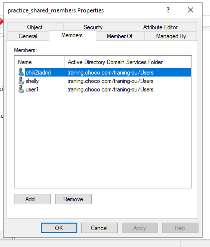
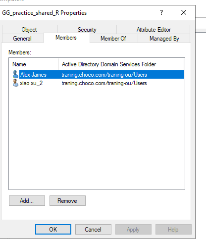
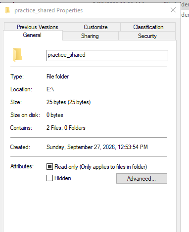
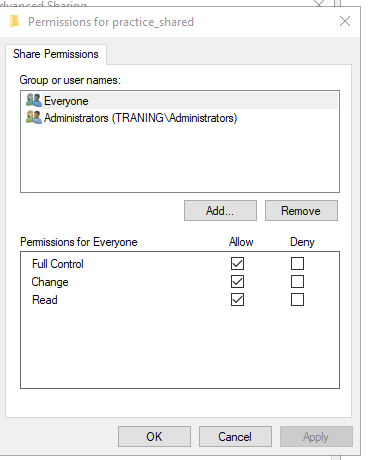
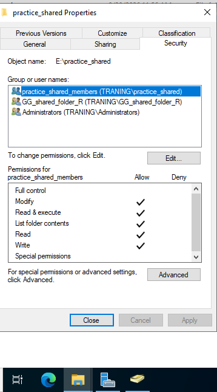
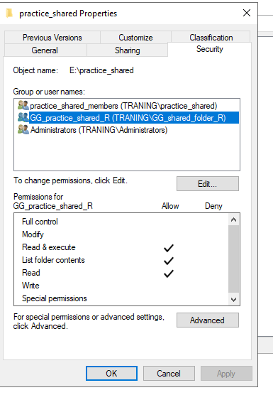
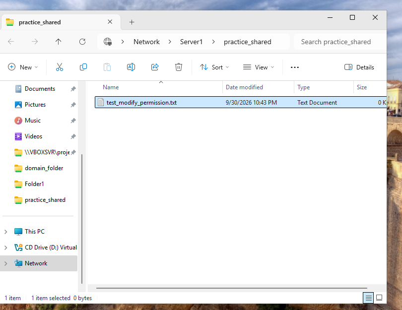
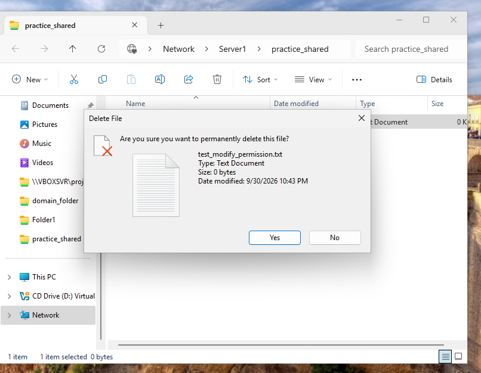
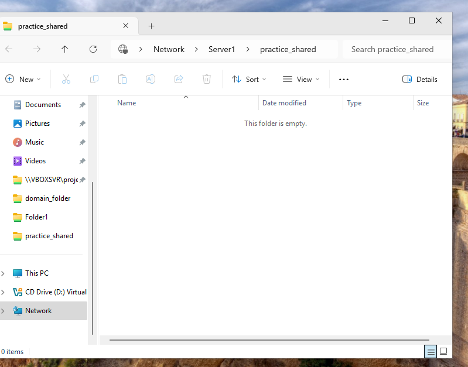
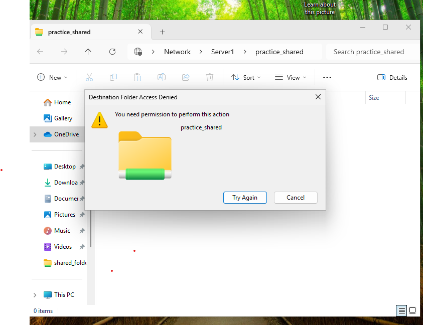

**# Windows Server File Share Access Control Using Active Directory Security Groups and NTFS Permissions**

**## Overview**

This project demonstrates configuring role-based access to a Windows Server shared folder using Active Directory security groups and NTFS permissions.

**## Objectives**

&#x20;    - 	Create Active Directory security groups for different access levels

&#x20;    -	Add users to the appropriate security groups

&#x20;    -	Create windows server shared folder

&#x20;    -	Apply share permission to everyone

&#x20;    -	Apply NTFS permissions based on user roles

&#x20;    -	Test access using different user accounts

**## Environments**

&#x20;    -	Windows Server

&#x20;    -	Active Directory Domain Services (AD DS)

&#x20;    -	Active Directory Users and Computers

&#x20;    -	Windows clients

&#x20;    -	NTFS permissions

&#x20;    -	Active Directory security groups

**## Evidence**

**## 1. Active Directory Security Groups**

Security groups are created in AD to manage access to shared folder based on user roles.

**## 2. Group Memberships**

Users were added to the appropriate security groups according to their required access level.

**## 3. Shared Folder Configuration**

The 'practice\_shared' folder was configured as a Windows Server shared folder.

**## 4. Share Permissions**

Share-level permissions were configured for the shard folder.

**## 5. NTFS Modify Permissions**

The group was granted NTFS modify permissions on the folder.

**## 6. NTFS Read Permissions**

The group was granted NTFS read permission on the folder.

**## 7. Access Testing - Modify Permission**

A user with modify permission successfully created and deleted a file.

\## 8. Access Testing - Read Permission

A user with read permission was unable to read file contents of the shared folder.

