**# Active Directory User \& Account Management**

**## Overview**

This project demonstrates common Active Directory user and account management tasks performed by a junior help desk or Level 1 IT support technician.

The lab focuses on creating and managing domain user accounts, handling account lockouts, resetting passwords, managing account status, and verifying group membership.

**## Objectives**

\-Create a domain user account

\-Configure and test an account lockout policy

\-Troubleshoot a locked user account

\-Disable and re-enable a user account

\-Reset a user's password

\-Verify successful password changes

\-Verify Active Directory group membership

\-Test account behavior from the user's perspective

**## Environment**

\-Windows Server

\-Active Directory Domain Services (AD DS)

\-Active Directory Users and Computers (AD UC)

\-Windows client

\-Domain User Accounts

\-Active Directory Security Groups

\-Group Policy

**## Tasks Performed**

&#x20;

**### 1. Create a Domain User**

Created a test domain user account using Active Directory Users and Computers.

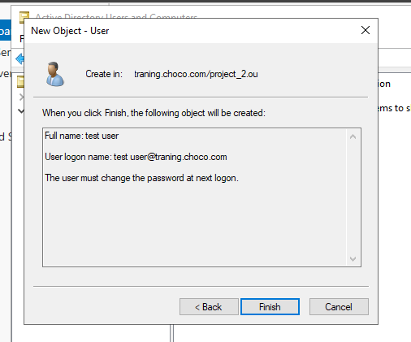

**### 2. Verify the User in Active Directory**

Verified that the new user account was successfully created in Active Directory.

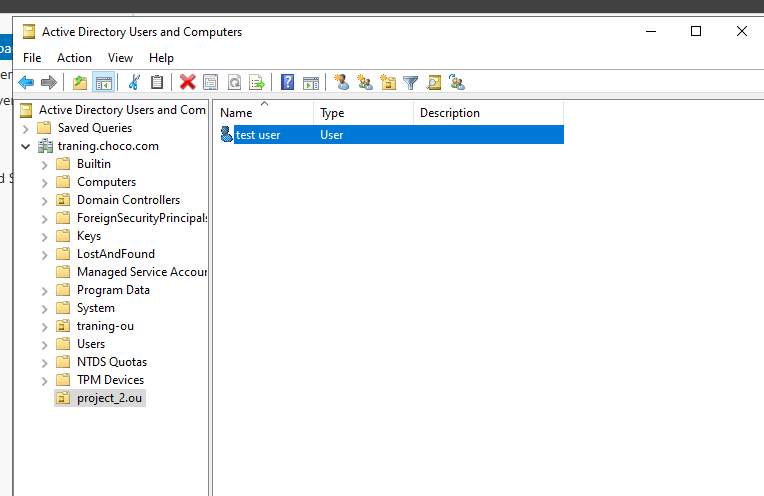

**### 3. Verify Domain User Login**

Tested the domain user account from the Windows client.

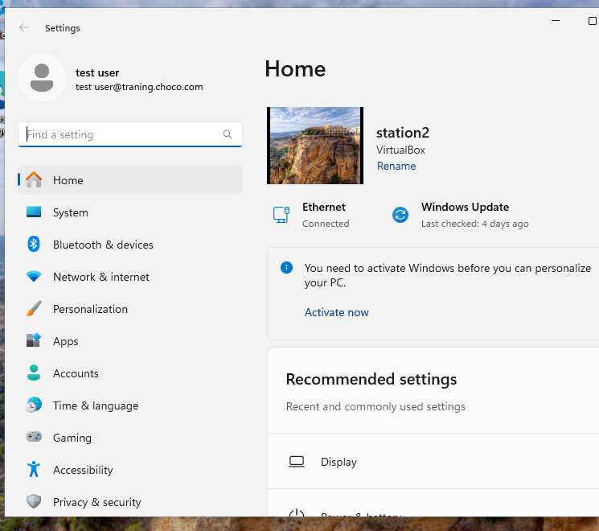

**### 4. Configure Account Lockout Policy**

Configured an account lockout threshold to help protect domain accounts against repeated incorrect password attempts.

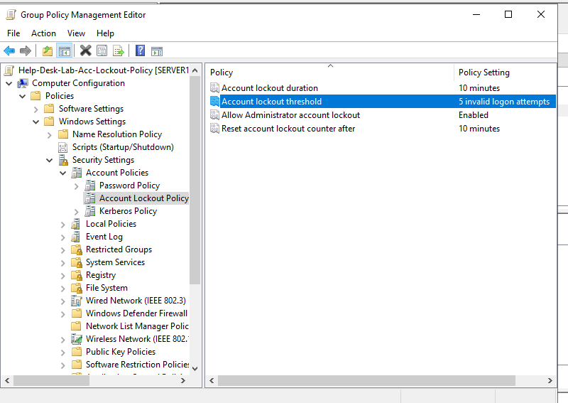

**### 5. Test Account Lockout**

Tested the policy by entering an incorrect password repeatedly and verifying that the account became locked.

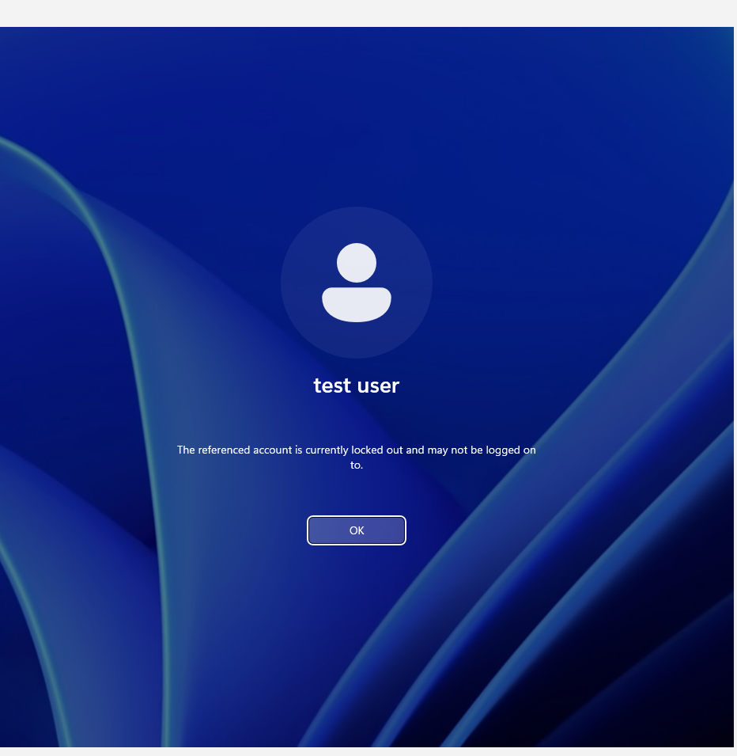

**### 6. Verify Account Lockout**

Verified that the user account was locked after entering incorrect password repeatedly.

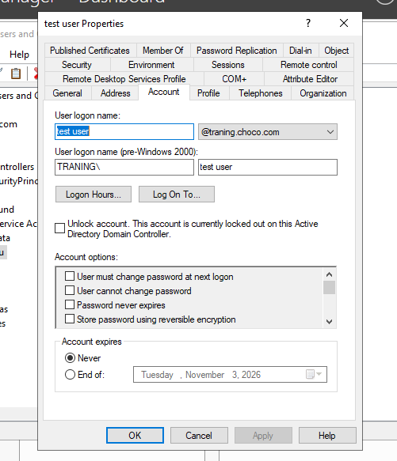

**### 7. Unlock the User Account**

Unlock the user's account using Active Directory Users and Computers.

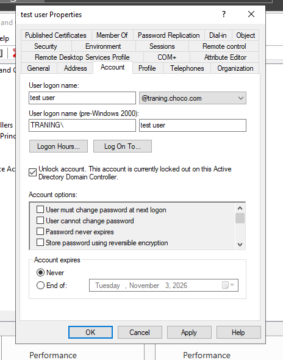

**### 8. Disable the User Account**

Disabled the domain user account.

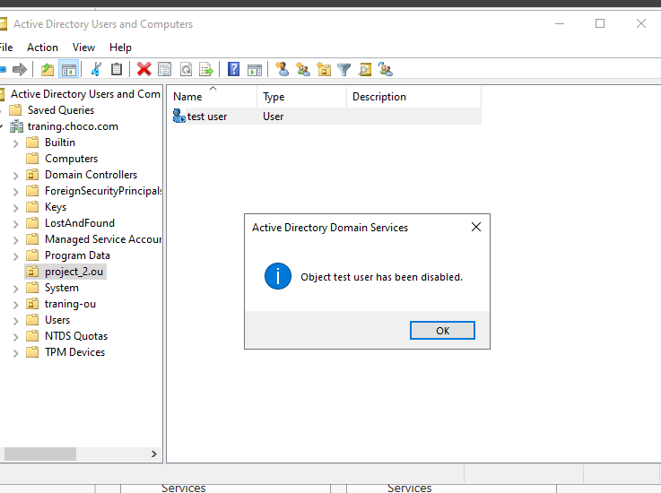

**### 9. Verify the Disabled Account**

Tested the account from the user's side and verified that the disabled account could not be used normally.

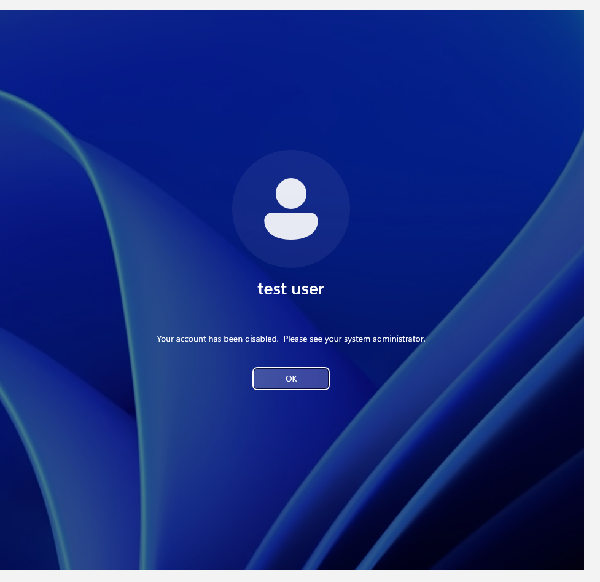

**### 10. Re-enable the User Account**

Re-enabled the disabled domain user account.

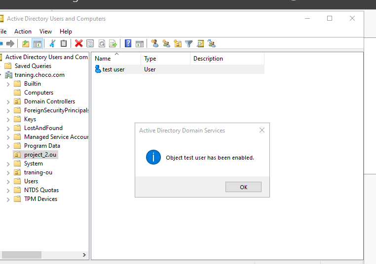

**### 11. Reset the User Password**

Performed the password reset for the domain user.

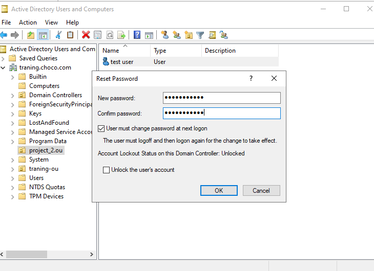

**### 12. Test the Reset Password**

Tested the new password after performing the password reset.

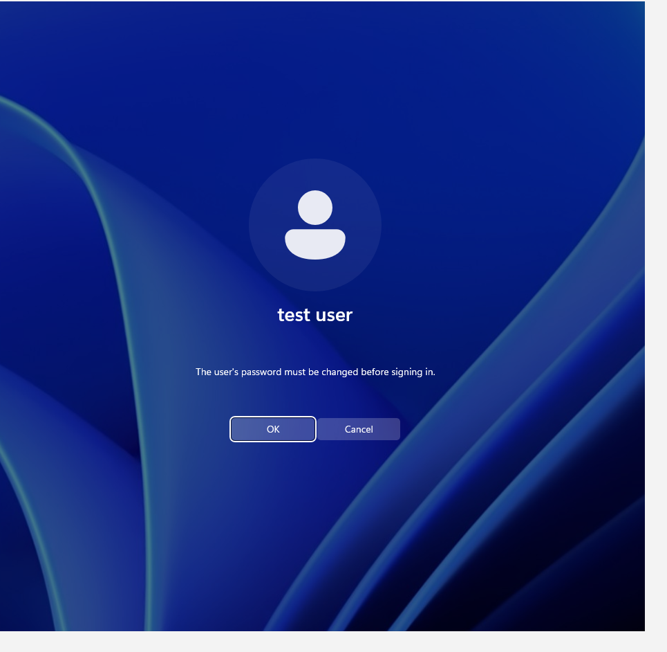

**### 13. Verify the New Password**

Verified that the user could successfully authenticate using the updated password.

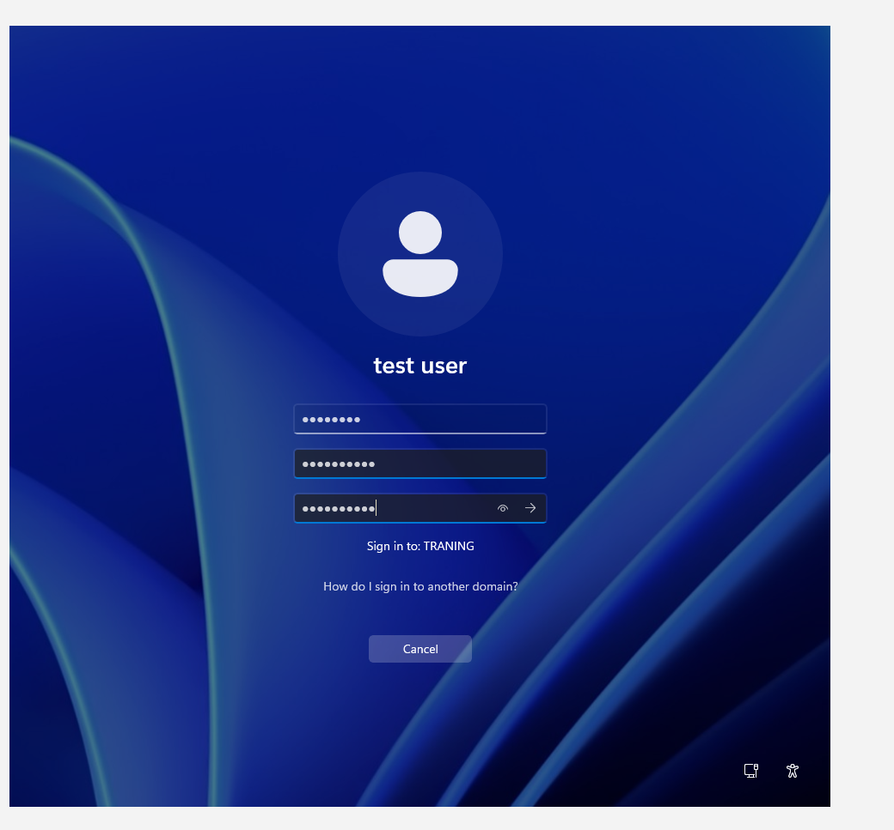

**### 14. Change the New Password After Reset**

Verified that the user successfully changed the new password.

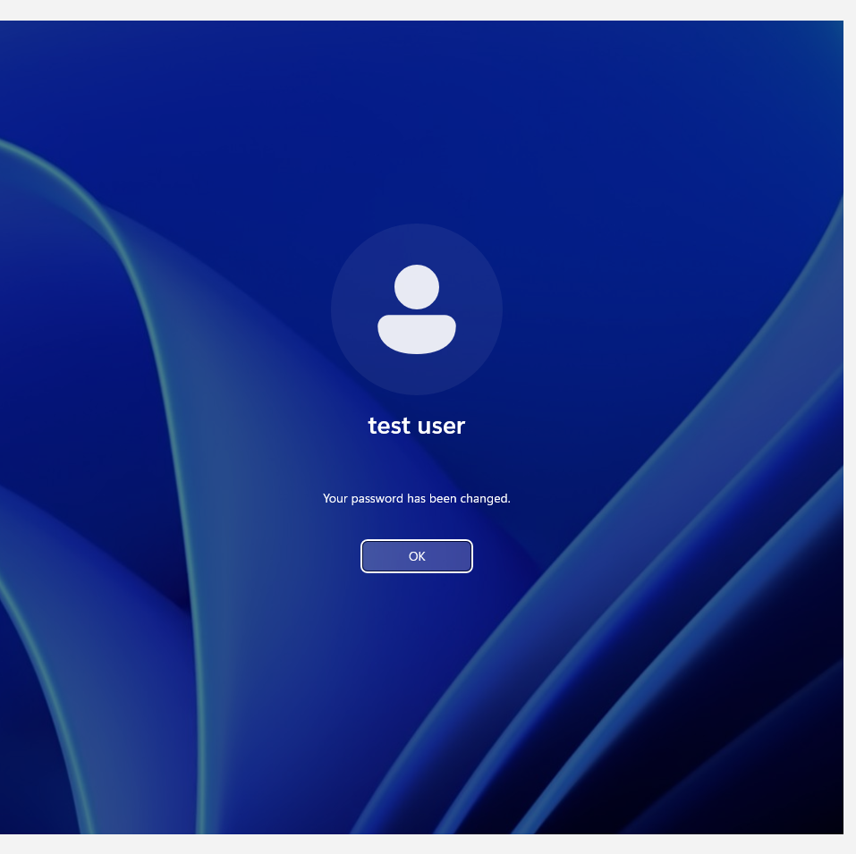

\### 15. Verify Group Membership

Verified that the user account belonged to the appropriate Active Directory Security Group.

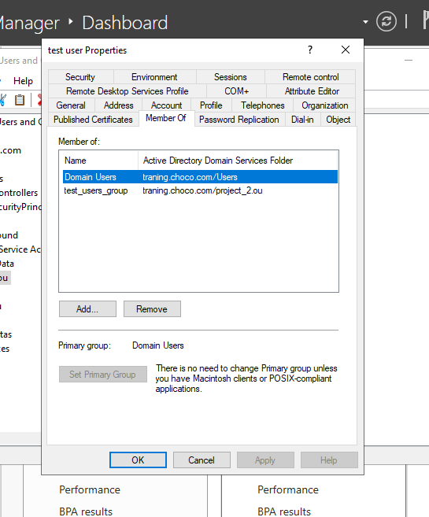

