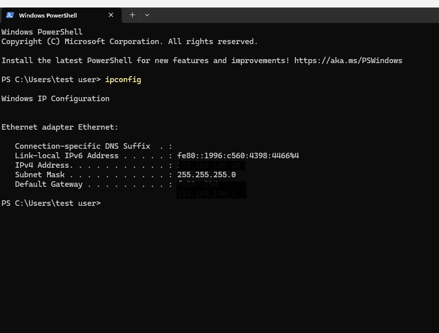
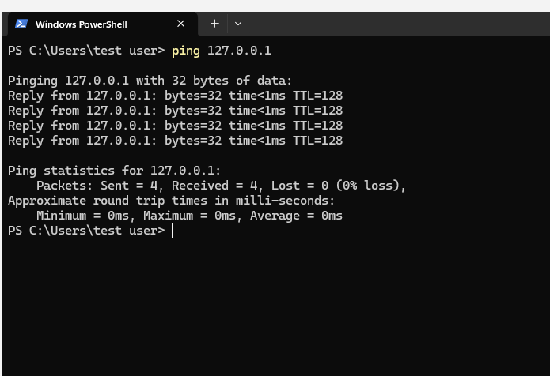
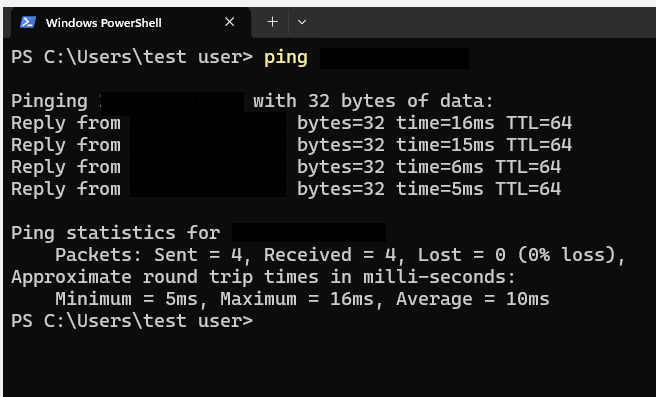
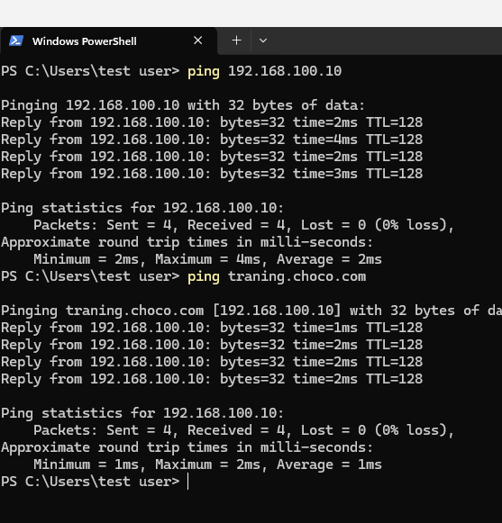
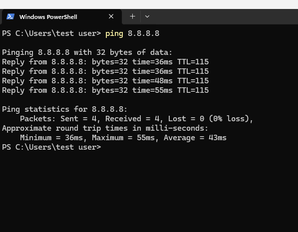
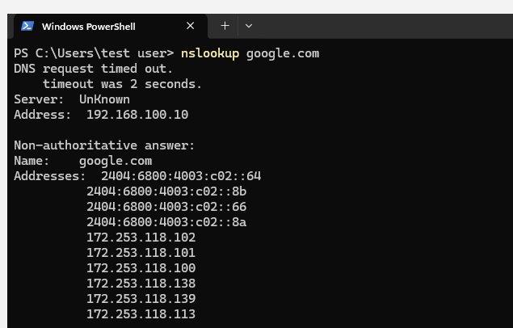
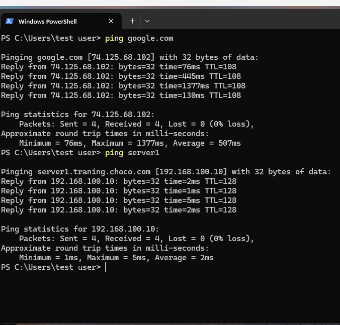
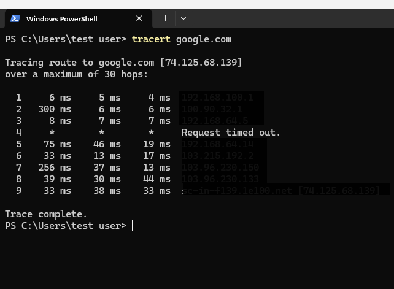

**# Windows Network Troubleshooting**

**## Overview**

This project demonstrates basic windows network troubleshooting in a virtual lab environment. I performed connectivity tests, checked IP configuration, investigated DNS resolution failures, and verified network connectivity after restoring the original settings.

**## Objectives**

&#x20;**-** Verify IP configuration and basic network connectivity

&#x20;- Test the local TCP/IP stack using loopback

&#x20;- Test internet connectivity using an IP address and hostname

&#x20;- Use 'nslookup', 'ping', and 'tracert' for network troubleshooting

&#x20;- Simulate a network adapter failure and verify recovery

&#x20;- Simulate an incorrect DNS configuration and troubleshoot neame-resolution failure

&#x20;- Verify connectivity after restoring the original settings

**## Environment**

&#x20;**-** Oracle virtual box

&#x20;- Windows client virtual machine

&#x20;- Windows Server virtual machine

&#x20;- Bridged network adapter

&#x20;- Windows PowerShell / Command Prompt

&#x20;- Network troubleshooting tools: 'ipconfig', 'nslookup', 'ping', and 'tracert'

**## Tasks Performed**

**### 1. Network Configuration and Connectivity Testing**

Used 'ipconfig' to review the Windows client's IP address, subnet mask, default gateway, and network configuration. This provides a baseline for troubleshooting connectivity problems.

**### 2. Loopback Connectivity Test**

Used 'ping 127.0.0.1' to verify that the local TCP/IP stack was responding. This test checks the local computer's networking functionality without sending traffic through the physical network. 

**### 3. Default Gateway Connectivity Test**

Used 'ping' to test connectivity to the default gateway. Successful replies indicated that the client could reach the gateway during this test.

**### 4. Windows Server Connectivity Test**

Used 'ping 192.168.100.10' to verify network connectivity between the Windows client and the Windows Server in the lab.

**### 5. Internet IP Connectivity Test**

Used 'ping 8.8.8.8' to test reachability to an external IP address without relying on DNS hostname resolution.

**### 6. DNS Resolution Test**

Used 'nslookup google.com' to check whether the DNS system could resolve a hostname to an IP address. 

**### 7. Hostname Connectivity Test**

Used 'ping' to test connectivity to hostnames, including 'google.com' and the lab domain hostname. This helped verify hostname resolution and network reachability.

\### 8. Network Path Inspection

Used 'tracert google.com' to inspect the network path toward an external destination. Some intermediate hops were redacted to protect network privacy.

